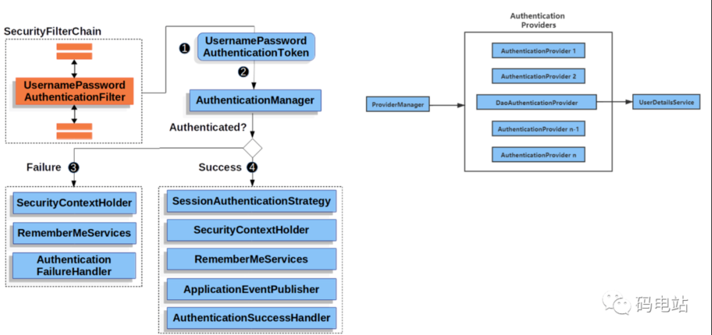
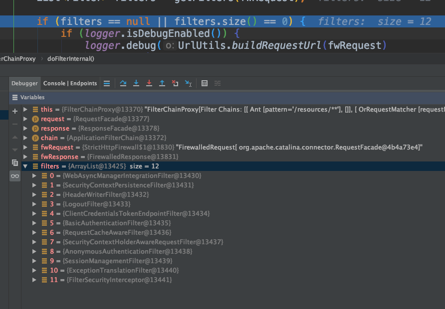
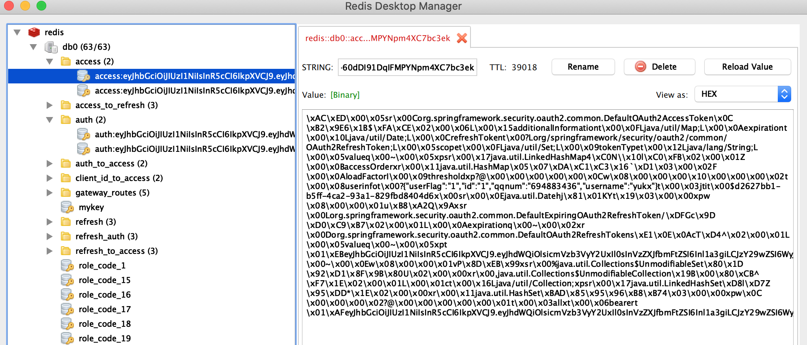
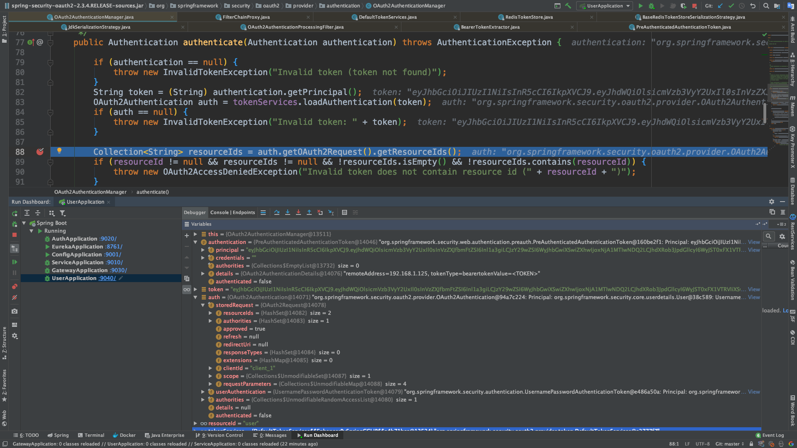

# OAuth2
##### 认证流程（网图）

`org.springframework.security.web.FilterChainProxy`
是filter链路代理入口类
```java
/**
* filter入口
*/
@Override
	public void doFilter(ServletRequest request, ServletResponse response,
			FilterChain chain) throws IOException, ServletException {
		boolean clearContext = request.getAttribute(FILTER_APPLIED) == null;
		if (clearContext) {
			try {
				request.setAttribute(FILTER_APPLIED, Boolean.TRUE);
				doFilterInternal(request, response, chain);
			}
			finally {
				SecurityContextHolder.clearContext();
				request.removeAttribute(FILTER_APPLIED);
			}
		}
		else {
			doFilterInternal(request, response, chain);
		}
	}
```
doFilterInternal() 方法
```java
private void doFilterInternal(ServletRequest request, ServletResponse response,
			FilterChain chain) throws IOException, ServletException {

		FirewalledRequest fwRequest = firewall
				.getFirewalledRequest((HttpServletRequest) request);
		HttpServletResponse fwResponse = firewall
				.getFirewalledResponse((HttpServletResponse) response);
        // **此方法获取所有filter链路**
		List<Filter> filters = getFilters(fwRequest);

		if (filters == null || filters.size() == 0) {
			if (logger.isDebugEnabled()) {
				logger.debug(UrlUtils.buildRequestUrl(fwRequest)
						+ (filters == null ? " has no matching filters"
								: " has an empty filter list"));
			}

			fwRequest.reset();

			chain.doFilter(fwRequest, fwResponse);

			return;
		}

		VirtualFilterChain vfc = new VirtualFilterChain(fwRequest, chain, filters);
		vfc.doFilter(fwRequest, fwResponse);
	}
```
采用`jwt`请求`/oauth/token`端点时经过的filter链

其中`org.springframework.security.oauth2.provider.client.ClientCredentialsTokenEndpointFilter`过滤器的`attemptAuthentication()`方法
```java
@Override
	public Authentication attemptAuthentication(HttpServletRequest request, HttpServletResponse response)
			throws AuthenticationException, IOException, ServletException {

		if (allowOnlyPost && !"POST".equalsIgnoreCase(request.getMethod())) {
			throw new HttpRequestMethodNotSupportedException(request.getMethod(), new String[] { "POST" });
		}

// 获取请求参数中的客户端信息
		String clientId = request.getParameter("client_id");
		String clientSecret = request.getParameter("client_secret");

		// If the request is already authenticated we can assume that this
		// filter is not needed
		Authentication authentication = SecurityContextHolder.getContext().getAuthentication();
		if (authentication != null && authentication.isAuthenticated()) {
			return authentication;
		}

		if (clientId == null) {
			throw new BadCredentialsException("No client credentials presented");
		}

		if (clientSecret == null) {
			clientSecret = "";
		}

// 把数据封装成UsernamePasswordAuthenticationToken对象
		clientId = clientId.trim();
		UsernamePasswordAuthenticationToken authRequest = new UsernamePasswordAuthenticationToken(clientId,
				clientSecret);

		return 
		//获取核心权限认证器 AuthenticationManager(默认为ProviderManager）
		this.getAuthenticationManager().authenticate(authRequest);

	}
```
`org.springframework.security.authentication.AuthenticationManager`为顶级权限认证接口，
它的默认实现类为`org.springframework.security.authentication.ProviderManager`
##### 1.验证 client 端filter为 `ClientCredentialsTokenEndpointFilter`
##### 2.验证 user 端为`AbstractUserDetailsAuthenticationProvider`
（唯一子类`DaoAuthenticationProvider`）
##### 3.user信息验证错误时，抛不出自己的错误信息原因为
```java
try {
				user = retrieveUser(username,
						(UsernamePasswordAuthenticationToken) authentication);
			}
			catch (UsernameNotFoundException notFound) {
				logger.debug("User '" + username + "' not found");
        // 该默认值为=true 所以所有的错误信息都被隐藏了
				if (hideUserNotFoundExceptions) {
					throw new BadCredentialsException(messages.getMessage(
							"AbstractUserDetailsAuthenticationProvider.badCredentials",
							"Bad credentials"));
				}
				else {
					throw notFound;
				}
			}
```
可以自定义Provider解决
```java
    @Bean
    public DaoAuthenticationProvider daoAuthenticationProvider() {
    // DaoAuthenticationProvider 是AbstractUserDetailsAuthenticationProvider的唯一子类
        DaoAuthenticationProvider provider = new DaoAuthenticationProvider();
        // 设置加载用户服务
        provider.setUserDetailsService(userDetailsService);
        // 使用BCrypt 进行密码的hash
        provider.setPasswordEncoder(new BCryptPasswordEncoder());
        // 禁止隐藏用户未找到异常
        provider.setHideUserNotFoundExceptions(false);
        return provider;
    }
```
###### 4.携带token访问资源服务时,会经过`org.springframework.security.oauth2.provider.authentication.OAuth2AuthenticationProcessingFilter`过滤器。里面默认的`AuthenticationManager`为`org.springframework.security.oauth2.provider.authentication.OAuth2AuthenticationManager`
```java
/**
* 该方法是验证token的权限，包含resources，client的验证
*/
public Authentication authenticate(Authentication authentication) throws AuthenticationException {

		if (authentication == null) {
			throw new InvalidTokenException("Invalid token (token not found)");
		}
		// 获取请求头中的token值
        String token = (String) authentication.getPrincipal();
		
		/**
		* 根据token获取redis里面存储的值
		* tokenServices默认为 DefaultTokenServices
		*/
		OAuth2Authentication auth = tokenServices.loadAuthentication(token);
		if (auth == null) {
			throw new InvalidTokenException("Invalid token: " + token);
		}

		Collection<String> resourceIds = auth.getOAuth2Request().getResourceIds();
		if (resourceId != null && resourceIds != null && !resourceIds.isEmpty() && !resourceIds.contains(resourceId)) {
			throw new OAuth2AccessDeniedException("Invalid token does not contain resource id (" + resourceId + ")");
		}

		checkClientDetails(auth);

		if (authentication.getDetails() instanceof OAuth2AuthenticationDetails) {
			OAuth2AuthenticationDetails details = (OAuth2AuthenticationDetails) authentication.getDetails();
			// Guard against a cached copy of the same details
			if (!details.equals(auth.getDetails())) {
				// Preserve the authentication details from the one loaded by token services
				details.setDecodedDetails(auth.getDetails());
			}
		}
		auth.setDetails(authentication.getDetails());
		auth.setAuthenticated(true);
		return auth;

	}
```
###### 5. 接着上面代码说到的`DefaultTokenServices`
```java
/**
* 根据token值加载用户信息
*/
public OAuth2Authentication loadAuthentication(String accessTokenValue) throws AuthenticationException,
			InvalidTokenException {
			// 获取redis中以access开头的key值，包含tokenType，token，scope，refreshToken
		OAuth2AccessToken accessToken = tokenStore.readAccessToken(accessTokenValue);
		if (accessToken == null) {
			throw new InvalidTokenException("Invalid access token: " + accessTokenValue);
		}
		else if (accessToken.isExpired()) {
			tokenStore.removeAccessToken(accessToken);
			throw new InvalidTokenException("Access token expired: " + accessTokenValue);
		}
// 根据token获取存储在redis中以auth开头的权限信息，包含此token所拥有的resources，authorities...
		OAuth2Authentication result = tokenStore.readAuthentication(accessToken);
		if (result == null) {
			// in case of race condition
			throw new InvalidTokenException("Invalid access token: " + accessTokenValue);
		}
		if (clientDetailsService != null) {
			String clientId = result.getOAuth2Request().getClientId();
			try {
				clientDetailsService.loadClientByClientId(clientId);
			}
			catch (ClientRegistrationException e) {
				throw new InvalidTokenException("Client not valid: " + clientId, e);
			}
		}
		return result;
	}
```
redis存储信息图片


最终根据token获取的所有信息截图
