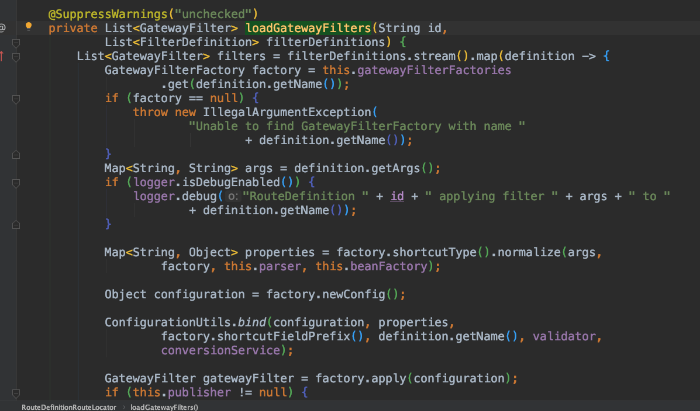
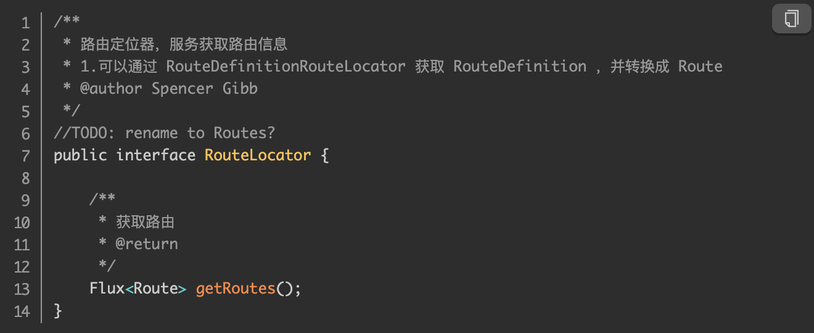
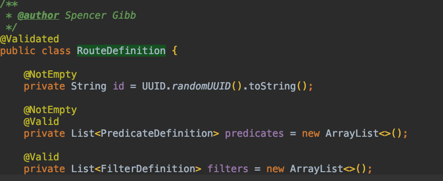
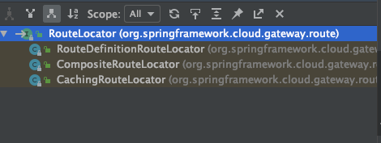
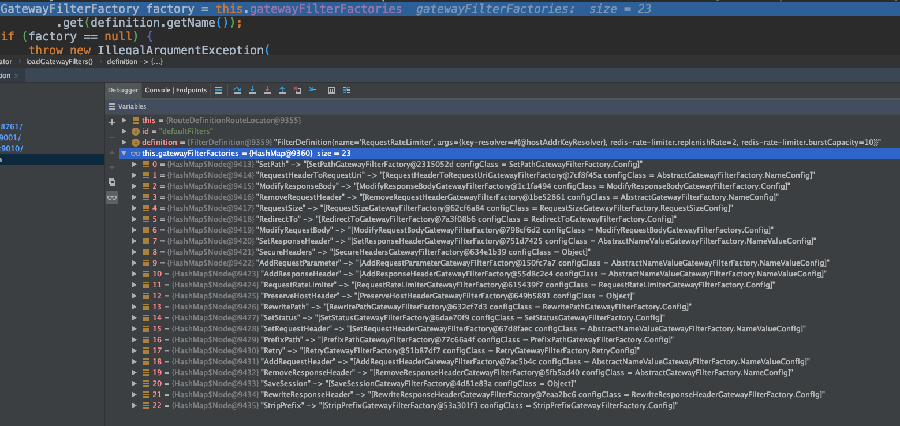
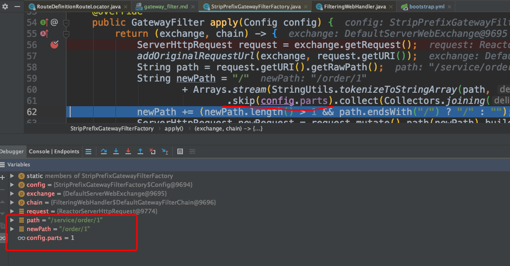

# Gateway
### 1. filter 加载位置

`org.springframework.cloud.gateway.route.RouteDefinitionRouteLocator.loadGatewayFilters`

### 2. 添加filter注意点
* 1. name 名称需要和默认filger工厂名称相同（[图2](#pic2)）
* 2. 如果配置了Path路由，注意看下uri路径
 比如 gateway 路径为  http://localhost:9030/service/order/1
 service是微服务名称，路由后的路径只是IP和端口改变，
 所以需要添加"StripPrefix" 过滤器:    [{"name":"StripPrefix","args":{"parts":"1"}}]
 它所对应的是StripPrefixGatewayFilterFactory实现（[图3](#pic2)）
 
### 3. 路由[Route]
1. `org.springframework.cloud.gateway.route.RouteLocator` 为顶层路由接口
2. 所有自定义路由信息基类为`org.springframework.cloud.gateway.route.RouteDefinition`
      
3. 该接口有三个实现 `org.springframework.cloud.gateway.route.RouteDefinitionRouteLocator`通过路由定义转换路由实现`org.springframework.cloud.gateway.route.CompositeRouteLocator`组合功能实现`org.springframework.cloud.gateway.route.CachingRouteLocator`缓存功能实现  

##### CachingRouteLocator

```java
/**
 * 路由定位器的包装类，实现了路由的本地缓存功能
 * @author Spencer Gibb
 */
public class CachingRouteLocator implements RouteLocator {

    /**
     * 目标路由定位器
     */
    private final RouteLocator delegate;

    /**
     * 路由信息
     * Flux 相当于一个 RxJava Observable，
     * 能够发出 0~N 个数据项，然后（可选地）completing 或 erroring。处理多个数据项作为stream
     */
    private final Flux<Route> routes;

    /**
     * 本地缓存，用于缓存路由定位器获取的路由集合
     *
     */
    private final Map<String, List> cache = new HashMap<>();
    public CachingRouteLocator(RouteLocator delegate) {
        this.delegate = delegate;
        routes = CacheFlux.lookup(cache, "routes", Route.class)
                .onCacheMissResume(() -> this.delegate.getRoutes().sort(AnnotationAwareOrderComparator.INSTANCE));
    }
    @Override
    public Flux<Route> getRoutes() {
        return this.routes;
    }

    /**
     * Clears the routes cache
     * @return routes flux
     */
    public Flux<Route> refresh() {
        this.cache.clear();
        return this.routes;
    }

    @EventListener(RefreshRoutesEvent.class)
    /* for testing */ void handleRefresh() {
        refresh();
    }
}
```
1. 此类实现了对路由信息的本地缓存，通过Map<String, List> cache 缓存路由到内存中
2. 此类通过@EventListener(RefreshRoutesEvent.class)监听RefreshRoutesEvent事件实现了对缓存的动态刷新。

##### CompositeRouteLocator
```java
/**
 *
 *  组合多个 RRouteLocator 的实现，为Route提供统一获取入口
 * @author Spencer Gibb
 */
public class CompositeRouteLocator implements RouteLocator {

    /**
     * 能够发出 0~N 个数据项(RouteLocator)，然后（可选地）completing 或 erroring。处理多个数据项作为stream
     */
    private final Flux<RouteLocator> delegates;

    public CompositeRouteLocator(Flux<RouteLocator> delegates) {
        this.delegates = delegates;
    }

    @Override
    public Flux<Route> getRoutes() {
        //this.delegates.flatMap((routeLocator)-> routeLocator.getRoutes());
        return this.delegates.flatMap(RouteLocator::getRoutes);
    }
}
```
1. 此类将遍历传入的目录路由定位器集合，组合每个路由定位器获取到的路由信息

##### RouteDefinitionRouteLocator
```java
/**
 * 路由定位器
 *  此实现通过路由定义（RouteDefinition）转换路由（Route）
 * {@link RouteLocator} that loads routes from a {@link RouteDefinitionLocator}
 * @author Spencer Gibb
 */
public class RouteDefinitionRouteLocator implements RouteLocator, BeanFactoryAware, ApplicationEventPublisherAware {
    
        public RouteDefinitionRouteLocator(RouteDefinitionLocator routeDefinitionLocator,
                                       List<RoutePredicateFactory> predicates,
                                       List<GatewayFilterFactory> gatewayFilterFactories,
                                       GatewayProperties gatewayProperties) {
        this.routeDefinitionLocator = routeDefinitionLocator;
        initFactories(predicates);
        gatewayFilterFactories.forEach(factory -> this.gatewayFilterFactories.put(factory.name(), factory));
        this.gatewayProperties = gatewayProperties;
    }
    
        @Override
    public Flux<Route> getRoutes() {
        //获取到所有的RouteDefinition
        return this.routeDefinitionLocator.getRouteDefinitions()
                //遍历转换成对应的Route信息
                .map(this::convertToRoute)
                //TODO: error handling
                .map(route -> {
                    if (logger.isDebugEnabled()) {
                        logger.debug("RouteDefinition matched: " + route.getId());
                    }
                    return route;
                });


        /* TODO: trace logging
            if (logger.isTraceEnabled()) {
                logger.trace("RouteDefinition did not match: " + routeDefinition.getId());
            }*/
    }
}
```
1. 此类的核心方法getRoutes通过传入的routeDefinitionLocator获取路由定位，并循环遍历路由定位依次转换成路由返回
2. 代码中可以看到getRoutes通过convertToRoute方法将路由定位转换成路由的
3. RouteDefinitionRouteLocator：RouteDefinition转换

```java
    /**
     * RouteDefinition 转换为对应的Route
     * @param routeDefinition
     * @return
     */
    private Route convertToRoute(RouteDefinition routeDefinition) {
        //获取routeDefinition中的Predicate信息
        Predicate<ServerWebExchange> predicate = combinePredicates(routeDefinition);
        //获取routeDefinition中的GatewayFilter信息
        List<GatewayFilter> gatewayFilters = getFilters(routeDefinition);
        //构建路由信息
        return Route.builder(routeDefinition)
                .predicate(predicate)
                .replaceFilters(gatewayFilters)
                .build();
    }
```


<span id="pic2">图2</span>
<span id="pic3">图3</span>