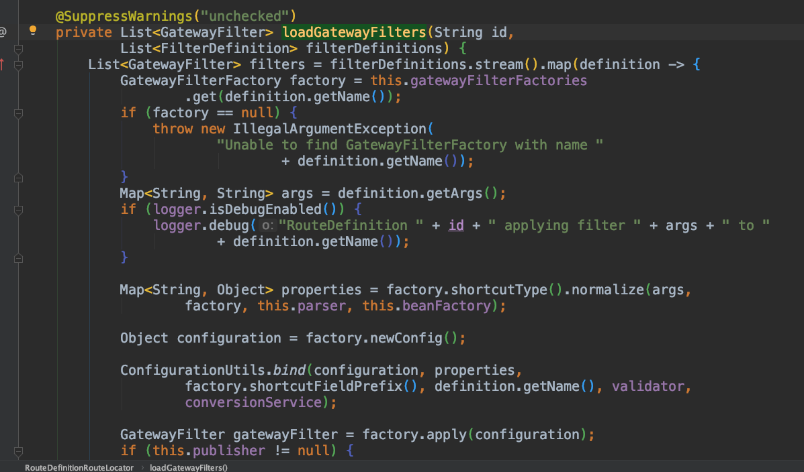

# **Gateway Filter**
### 1. filter 加载位置

`org.springframework.cloud.gateway.route.RouteDefinitionRouteLocator.loadGatewayFilters`

### 2. 添加filter注意点
    1. name 名称需要和默认filger工厂名称相同（图2）
    2. 如果配置了Path路由，注意看下uri路径
        1.比如 gateway 路径为  http://localhost:9030/service/order/1
          service是微服务名称，路由后的路径只是IP和端口改变，
          所以需要添加"StripPrefix" 过滤器:[{"name":"StripPrefix","args":{"parts":"1"}}]
          它所对应的是StripPrefixGatewayFilterFactory实现（图3）
图2
图3